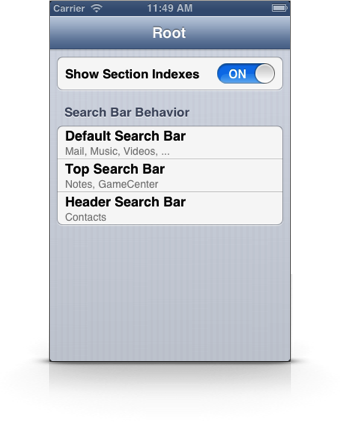
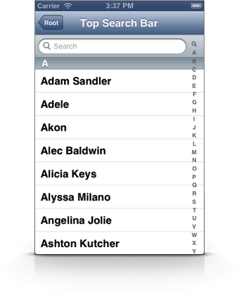

# iOS 7
In iOS 7 most of Apple's apps now use the default search bar behavior. Unsurprisingly, the default search bar behavior is the only one that works fine without any modifications when compiled against the iOS 7 SDK.

This demo project won't be updated to support iOS 7, but I'll gladly accept pull requests.

**TableViewSearchBar** is a small demo project that demonstrates the various scrolling behaviors of a *UISearchBar* inside a *UITableView* found in Apple's own apps.

The project has been made in order to answer [this stackoverflow question](http://stackoverflow.com/questions/14759506/ios-native-contacts-app-sticky-search-bar-and-section-header-behavior "iOS native Contacts App: sticky search bar and section header behavior").

There are three different behaviors in Apple's apps:

- **Default**: The search bar scrolls with the table view
- **Top**: The search bar scrolls with the table view but always stays at the top if you scroll the table view up
- **Header**: The search bar usually stays at the top of the table view but scrolls with the table view if you scroll the table view up

The last one is only used in the Contacts app and is quite interesting. Take a look at [FKRHeaderSearchBarTableViewController.m](TableViewSearchBar/FKRHeaderSearchBarTableViewController.m "FKRHeaderSearchBarTableViewController.m") in order to see how it works in detail.

- - -

- - - - -

# License
MIT License

	Copyright (c) 2013 Fabian Kreiser
	
	Permission is hereby granted, free of charge, to any person obtaining a copy of
	this software and associated documentation files (the "Software"), to deal in
	the Software without restriction, including without limitation the rights to use,
	copy, modify, merge, publish, distribute, sublicense, and/or sell copies of the
	Software, and to permit persons to whom the Software is furnished to do so,
	subject to the following conditions:
	
	The above copyright notice and this permission notice shall be included in all
	copies or substantial portions of the Software.
	
	THE SOFTWARE IS PROVIDED "AS IS", WITHOUT WARRANTY OF ANY KIND, EXPRESS OR
	IMPLIED, INCLUDING BUT NOT LIMITED TO THE WARRANTIES OF MERCHANTABILITY, FITNESS
	FOR A PARTICULAR PURPOSE AND NONINFRINGEMENT. IN NO EVENT SHALL THE AUTHORS OR
	COPYRIGHT HOLDERS BE LIABLE FOR ANY CLAIM, DAMAGES OR OTHER LIABILITY, WHETHER
	IN AN ACTION OF CONTRACT, TORT OR OTHERWISE, ARISING FROM, OUT OF OR IN
	CONNECTION WITH THE SOFTWARE OR THE USE OR OTHER DEALINGS IN THE SOFTWARE.